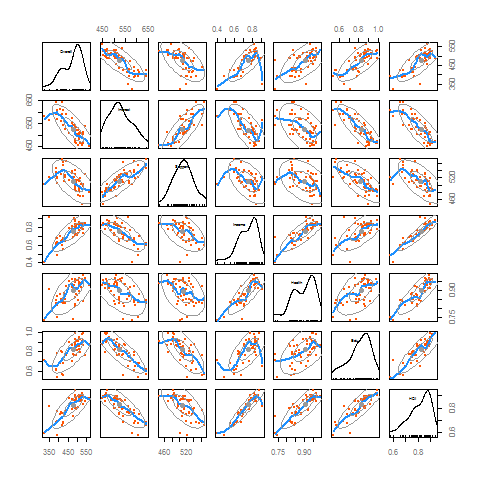

# <a name='application'>Application Using R</a>


## <a name='initialExam'>Initial Examination</a>

<span class="newthought">The data set has been constructed</span> using average Science scores by country from the Programme for International Student Assessment ([PISA](http://www.pisa.oecd.org/)) 2006, along with GNI per capita (Purchasing Power Parity, 2005 dollars), Educational Index, Health Index, and Human Development Index from [UN data](http://hdr.undp.org/en/data).  The key variables are as follows (variable abbreviations in bold):

<span class="marginnote">The education component is measured by mean of years of schooling for adults aged 25 years and expected years of schooling for children of school entering age, the health index by life expectancy at birth, and the wealth component is based on the gross national income per capita. The HDI sets a minimum and a maximum for each dimension, and values indicate where each country stands in relation to these endpoints, expressed as a value between 0 and 1. More information on the HDI measures can be found [here](http://hdr.undp.org/en/statistics/hdi/).</span>

- **Overall** Science Score (average score for 15 year olds)
- **Interest** in science
- **Support** for scientific inquiry
- **Income** Index
- **Health** Index
- **Edu**cation Index
- **H**uman **D**evelopment **I**ndex (composed of the Income index, Health Index, and Education Index)

But even before we get too far, it would be good to know our options in the world of GAMs. Near the end of this document is a list of some packages to be aware of, and there is quite a bit of GAM functionality available within R, even for just plotting<span class="marginnote"><span class="pack">ggplot2</span> has basic gam functionality for scatterplot smoothing.  Examples are further in the text.</span>.  For our purposes we will use <span class="pack">mgcv</span>. 

The first thing to do is get the data in and do some initial inspections.

```{r initial_inspection_of_pisa, echo=1:2, eval=1:2}
pisa = read.csv('data/pisasci2006.csv')
psych::describe(pisa)[-1,1:9]  #univariate

png(file='vis/scattermatrix.png', bg='transparent')
car::scatterplotMatrix(pisa[,-c(1,3:5)],pch=19,cex=.5,reg.line=F, lwd=1,
                       spread=F,ellipse=T, col=c('gray60','#1e90ff','#FF5503'),
                       col.axis='gray50', cex.labels=.5)
dev.off()
library(GGally)
ggpairs(pisa[,-c(1,3:5)], 
        lower=list(continuous=wrap('smooth',  alpha=.2, color=c('#ff5503'), method='loess')), 
        diag = list(continuous=wrap('densityDiag', color='gray50')),
        upper='blank', axisLabels="none") + 
  theme_trueMinimal() +
  theme(axis.text.x=element_text(color='gray50'))
```



The scatterplot matrix has quite a bit of information to spend some time with- univariate and bivariate density, as well as loess curves.  For our purposes we will ignore the issue regarding the haves vs. have-nots on the science scale and save that for another day. Note the surprising negative correlation between interest and overall score for science, which might remind us of [Simpson's paradox](http://en.wikipedia.org/wiki/Simpson_paradox), namely, that what occurs for the individual may not be the same for the group. One will also note that while there is a positive correlation between Income and Overall science scores, it flattens out after an initial rise. Linear fits might be difficult to swallow for human development sub-scales in general, but let's take a closer look.

<a name='countryscatter'></a>

```{r scatterwrap, echo=F}
library(ggplot2); library(tidyr)
#get data into a form to take advantage of ggplot
# dmelt = melt(pisa, id=c('Country','Overall'), 
#              measure=c('Interest','Support','Income','Health','Edu','HDI'))

dmelt = gather(dplyr::select(pisa, -Evidence, -Explain, -Issues), key=Variable, value=Value, -Overall,-Country)

#leave the smooth off for now
scatterwrap = ggplot(aes(x=Value,y=Overall), data=dmelt) +
  geom_point(color='#FF5503',alpha=.75) +
  #geom_smooth(se=F) +
  geom_text(aes(label=Country), alpha=0, size=1,angle=30, hjust=-.2,   # making transparent so only plotly will show the country
            vjust=-.2) +
  facet_wrap(~Variable, scales='free_x') +
  labs(x='') +
  theme_trueMinimal() 

ggplotly(scatterwrap, width='75%') %>% 
  layout(paper_bgcolor='rgba(0,0,0,0)', plot_bgcolor='rgba(0,0,0,0)')
```

We can see again that linear fits aren't going to do so well for some, though it might be a close approximation for interest in science and support for science.  Now let's run the smooth.  By default <span class="pack">ggplot2</span> will use a loess smoother for small data sets (i.e. < 1000 observations), but can use the <span class="pack">mgcv</span><span class="function">gam</span> function as a smoother.

```{r scatterwrapSmooth,  echo=F}
scatterwrapSmooth = ggplot(aes(x=Value,y=Overall), data=dmelt) +
  geom_point(color='#FF8000',alpha=.75) +
  geom_smooth(se=F, lwd=.5, color='#1e90ff') +
  geom_text(aes(label=Country), alpha=0, size=1,angle=30, hjust=-.2,   # making transparent so only plotly will show the country
            vjust=-.2) +
  facet_wrap(~Variable, scales='free_x') +
  labs(x='') +
  theme_trueMinimal() +
  theme(plot.background=element_rect(color='transparent'))
ggplotly(scatterwrapSmooth, width='75%') %>% 
  layout(paper_bgcolor='rgba(0,0,0,0)', plot_bgcolor='rgba(0,0,0,0)')
```

Often in these situations people will perform some standard transformation, such as a log, but it doesn't help as nearly as often as it is used.  For example, in this case one can log the overall score, Income, or both and a linear relation will still not be seen.


## <a name='singlePredictor'>Single Predictor</a>

### <a name='linearFitSingle'>Linear Fit</a>

We will start with the simple situation of a single predictor. Let's begin by using a typical linear regression to predict science scores by the Income index.  We could use the standard R <span class="func">lm</span> function, but I'll leave that as an exercise for comparison.  We can still do straightforward linear models with the <span class="func">gam</span> function, and again it is important to note that the standard linear model can be seen as a special case of a GAM.

```{r mod_lm}
library(mgcv)
mod_lm <- gam(Overall ~ Income, data=pisa)
summary(mod_lm)
```

What are we getting here?  The same thing you get from a regular linear model, because you just ran one.  However there are a couple things to look at.  The coefficient is statistically significant, but serves as a reminder that it usually a good idea to scale predictor variables so that the effect is more meaningful.  Here, moving one unit on Income is akin from going broke to being the richest country.  But in a more meaningful sense, if we moved from say, .7 to .8, we'd expect an increase of about 35 points on the science score.  We also see the deviance explained<label for="sn-demo" class="margin-toggle sidenote-number"></label><input type="checkbox" id="sn-demo" class="margin-toggle"/><span class="sidenote">For those more familiar with generalized linear models, this is calculated as (Dev$_{Null}$-Dev$_{Residual}$)/Dev$_{Null}$ <br>
One can verify this by running the same model via the <span class="func">glm</span>, and using the corresponding values from the summary of the model object.</span>, which serves as a generalization of R-squared, and in this case, it actually is equivalent to the unadjusted R-squared.  Likewise there is the familiar adjusted version of it to account for small sample size and model complexity.  The scale estimate is the scaled deviance, which here is equivalent to the residual sums of squares.  The GCV score we will save for when we run a GAM.

### <a name='GAMSingle'>GAM</a>

Let's now try some nonlinear approaches, keeping in mind that $\mu=f(x)$.  As a point of comparison, we can start by trying a standard polynomial regression, and it might do well enough<span class="marginnote">This example is pretty much straight from @wood_generalized_2006 with little modification.</span>.  To begin we must consider a <span class="emph">basis</span> to use, a space that $f$ is an element of. Doing so leads to choosing  a set of <span class="emph">basis functions</span> $b_j$, with parameters $\beta_j$ that will be combined to produce $f(x)$:

$$f(x)=\displaystyle\sum\limits_{j=1}^q b_{j}(x)\beta_{j}$$

To better explain by example, if we use a cubic polynomial, the basis is: $b_1(x) = 1$, $b_2(x)=x$, $b_3(x)=x^2$, $b_4(x)=x^3$, which leads to the following:

$$f(x) = \beta_1 + \beta_2x + \beta_3x^2 + \beta_4x^3$$

The following visualization allows us to see the effects in action. It is based on the results extracted from running such a model<label for="sn-demo" class="margin-toggle sidenote-number"></label><input type="checkbox" id="sn-demo" class="margin-toggle"/><span class="sidenote">See <span class="func">poly</span> for how to fit a polynomial in R.</span> and obtaining the coefficients. The first plot represents the intercept of 470.44, the second plot, our $b_2$ coefficient of 289.5 multiplied by Income and so forth.  The bottom plot shows the final fit $f(x)$, i.e. the linear combination of the basis functions. 

```{r polynomialBasis, echo=F}
dpoly = rbind(pisa,pisa,pisa,pisa,pisa)
dpoly$basis = factor(rep(1:5,e=nrow(pisa)))
levels(dpoly$basis) = c(expression(paste(b[1],"=1")),expression(paste(b[2],"=x")),expression(paste(b[3],"=x^2")),
                        expression(paste(b[4],"=x^3")), expression(f(x)))

# NOTE plotly can't do mathjax/latex as of 06-2016
levels(dpoly$basis) = c('Intercept', 'x', "x^2", 'x^3', 'f(x)')

#head(dpoly)
#str(dpoly)
# ggplot(aes(x=Income, y=Income), data=dpoly) +
#   geom_smooth(method='lm',se=F, formula=y~1,data = dpoly[1:65,], col='black') + #indexing gets around basis == expression
#   geom_line(data = dpoly[66:130,]) +
#   geom_line(aes(x=Income, y=Income^2),data = dpoly[131:195,]) +
#   geom_line(aes(x=Income, y=Income^3),data = dpoly[196:260,]) +
#   ylab("") +
#   geom_smooth(aes(x=Income, y=Overall),se=F, method='lm', formula=y~poly(x,3),data = dpoly[261:325,], col='black') +
#   facet_grid(basis~., scales='free_y', labeller=label_parsed) +
#   theme_trueMinimal()

#na.omit(pisa$Income)~
# ggplot(aes(x=Income, y=Overall), data=pisa) +
#   geom_smooth(se=F, method='lm', formula=y~poly(x,3))
# 
# d_OI_nona <- na.omit(pisa[,c('Overall','Income')])
# mod_poly <- gam(Overall~poly(Income,3), data=d_OI_nona)
# summary(mod_poly)

### polynomial with coefficients  

polynomialBasis = ggplot(aes(x=Income, y=Income), data=dpoly) +
  geom_line(aes(x=Income, y=470.44),data = dpoly[1:65,], color="#1e90ff") + #indexing gets around basis == expression
  geom_line(aes(x=Income, y=Income*289.5), data = dpoly[66:130,], color="#1e90ff") +
  geom_line(aes(x=Income, y=Income^2*(-84.6)),data = dpoly[131:195,], color="#1e90ff") +
  geom_line(aes(x=Income, y=Income^3*(-113.6)),data = dpoly[196:260,], color="#1e90ff") +
  ylab("") +
  geom_smooth(aes(x=Income, y=Overall), se=F, method='lm', formula=y~poly(x,3), data = dpoly[261:325,], color="#1e90ff", lwd=.5) +
  facet_grid(basis~., scales='free_y') +  # , labeller=label_parsed if using expressions
  theme_trueMinimal() 

ggplotly(polynomialBasis, width='75%') %>% 
  layout(paper_bgcolor='rgba(0,0,0,0)', plot_bgcolor='rgba(0,0,0,0)')
```

At this point we have done nothing we couldn't do in our regular regression approach, as polynomial regression has a long history of use in modeling. However, the take home message is that as we move to GAMs we are going about things in much the same fashion; we are simply changing the nature of the basis, and have a great deal more flexibility in choosing the form.

In the next figure I show the fit using a 'by-hand' cubic spline basis (see the [Appendix](#Penalized_Estimation_Example) and p.126-7 in @wood_generalized_2006).  

```{r csbyhand, echo=FALSE}
rk <- function(x,z) {
  ((z-0.5)^2 - 1/12)*((x-0.5)^2 - 1/12)/4-
    ((abs(x-z)-0.5)^4-(abs(x-z)-0.5)^2/2 + 7/240) / 24
}

spl.X <- function(x,xk){
  q <- length(xk) + 2
  n <- length(x)
  X <- matrix(1,n,q)
  X[,2] <- x
  X[,3:q] <- outer(x,xk,FUN=rk)
  X
}

# xk = quantile(pisa$Income, na.rm=T)[2:4]
# xk = c(.66,.74,.83)
xk = seq(.658,.833, len=8)
#xk = quantile(pisa$Income, na.rm=T)[1:4]
X <- spl.X(pisa$Income,xk)
mod.1 <- lm(Overall~X-1, data=pisa)
xp <- 40:100/100
Xp <- spl.X(xp, xk)

csbyhand = ggplot(aes(x=Income, y=Overall), data=pisa)+
  geom_point(color="#FF5503", alpha=.75) +
  geom_smooth(se=F, method='gam', formula=y~s(x, bs='cs', k=8, xt=list(knots=xk)), color=scales::alpha('darkred',.5), lwd=.5) +
  geom_line(aes(x=xp, y=Xp%*%coef(mod.1)), data=data.frame(xp,Xp), color="#1e90ff", lwd=.5) +
  xlim(.4,1) +
  theme_trueMinimal()

ggplotly(csbyhand, width='75%') %>% 
  layout(paper_bgcolor='rgba(0,0,0,0)', plot_bgcolor='rgba(0,0,0,0)')
```

A cubic spline is essentially a connection of multiple cubic polynomial regressions.  We choose points of the predictor variable at which to create sections, and these points are referred to as <span class="emph">knots</span>.  Separate cubic polynomials are fit at each section, and then joined at the knots to create a continuous curve.  The above graph represents a cubic spline with 8 knots<label for="sn-demo" class="margin-toggle sidenote-number"></label><input type="checkbox" id="sn-demo" class="margin-toggle"/><span class="sidenote">Ten including the endpoints.</span> between the first and third quartiles. The red line uses the GAM functionality within ggplot2's <span class="func">geom\_smooth</span> as a point of comparison.


#### Fitting the mdoel

Let's now fit an actual generalized additive model using the same cubic spline as our basis. We again use the <span class="func">gam</span> function as before for basic model fitting, but now we are using a function <span class="func">s</span> within the formula to denote the smooth terms.  Within that function we also specify the type of smooth, though a default is available.  I chose `bs = cr`, denoting cubic regression splines, to keep consistent with our previous example.

```{r mod_gam1}
mod_gam1 <- gam(Overall ~ s(Income, bs="cr"), data=pisa)
summary(mod_gam1)
```


The first thing to note is, that aside from the smooth part, our model code is similar to what we're used to with core R functions such as <span class="func">lm</span> and <span class="func">glm</span>.  In the summary, we first see the distribution assumed as well as the link function used, in this case normal and identity, respectively, which to iterate, had we had no smoothing, would result in a SLiM.  After that we see that the output is separated into <span class="emph">parametric</span> and <span class="emph">smooth</span>, or nonparametric parts<label for="sn-demo" class="margin-toggle sidenote-number"></label><input type="checkbox" id="sn-demo" class="margin-toggle"/><span class="sidenote">As an aside, the term *nonparametric* has at least two general uses in the statistical world. [Wikipedia](https://en.wikipedia.org/wiki/Nonparametric_statistics) has a nice delineation.</span>.  In this case, the only parametric component is the intercept, but it's good to remember that you are not bound to smooth every effect of interest, and indeed, as we will discuss in more detail later, part of the process may involve refitting the model with terms that were found to be linear for the most part anyway.  The smooth component of our model regarding a country's income and its relationship with overall science score suggests it is statistically significant, but there are a couple of things in the model summary that would be unfamiliar.  

<span class="marginnote">This part regarding edf should ring a bell for those who use the <span class="pack">lme4</span> package for mixed models. All of this applies there too, and may provide more insight as to why they don't even provide p-values as a default. See the [Other Approaches](#cats) section.</span>We'll start with the <span class="emph">effective degrees of freedom</span>, or **edf**.  In typical OLS regression the model degrees of freedom is equivalent to the number of predictors/terms in the model. This is not so straightforward with a GAM due to the smoothing process and the penalized regression estimation procedure, something that will be discussed more later<label for="sn-demo" class="margin-toggle sidenote-number"></label><input type="checkbox" id="sn-demo" class="margin-toggle"/><span class="sidenote">In this example there are actually 9 terms associated with this smooth, but they are each 'penalized' to some extent and thus the edf does not equal 9.</span>. In this situation, we are still trying to minimize the residual sums of squares, but also have a built in penalty for 'wiggliness' of the fit, where in general we try to strike a balance between an undersmoothed fit and an oversmoothed fit. The default p-value for the test is based on the effective degrees of freedom and the rank $r$ of the covariance matrix for the coefficients for a particular smooth, so here, *conceptually*, it is the p-value associated with the $F(r, n-edf)$.  However there are still other issues to be concerned about, and `?summary.gam` will provide your first step down that particular rabbit hole. For hypothesis testing an alternate edf is actually used, which is the other one provided there in the summary result<label for="sn-demo" class="margin-toggle sidenote-number"></label><input type="checkbox" id="sn-demo" class="margin-toggle"/><span class="sidenote">Here it is noted `Ref.df` but if, for example, the argument `p.type = 5` is used, it will be labeled `Est.Rank`. Also, there are *four* p-value types one can choose from.  The full story of edf, p-values and related is scattered throughout Wood's text. See also `?anova.gam`</span>.  At this point you might be thinking these p-values are a bit fuzzy, and you'd be right. The gist is, they aren't to be used for harsh cutoffs, say, at an arbitrary .05 level<label for="sn-demo" class="margin-toggle sidenote-number"></label><input type="checkbox" id="sn-demo" class="margin-toggle"/><span class="sidenote">But then, standard p-values shouldn't be used that way either.</span>, but if they are pretty low you can feel comfortable claiming statistical significance, which of course is the end all, be all, of the scientific endeavor- right?

```{r pvalue, echo=FALSE, eval=FALSE}
# pf(fval5, mod_gam1$smooth[[1]]$df,mod_gam1$df.res,lower=F)
# where fval5 comes from `summary(mod, p.type=5)`; tested with interest as the predictor   pf(14.75, 9, 46.1, lower=F)
```

The GCV, or <span class="emph">generalized cross validation</span> score can be taken as an estimate of the *mean square prediction error* based on a leave-one-out cross validation estimation process.  We estimate the model for all observations except $i$, then note the squared residual predicting observation $i$ from the model.  Then we do this for all observations. However, the GCV score is an efficient measure of this concept that doesn't actually require fitting all those models and overcomes other issues<span class="marginnote">In this initial model the GCV can be found as: $$GCV = \frac{n*scaled\, est.}{(n-edf-{[n\,of\, parametric\, terms]})^{2}}$$</span>.  It is this score that is minimized by default when determining the specific nature of the smooth.  On its own it doesn't tell us much, but we can use it similar to AIC as a comparative measure to choose among different models, with lower being better.  

### <a name='graphDispSingle'>Graphical Display</a>

One can get  sense of the form of the fit by simply plotting the model object as follows:

```{r plot_mod_gam1, echo=2, eval=c(1,3:5), fig.width=8, fig.height=5}
par(bg='transparent')
plot(mod_gam1)
plot(mod_gam1, bty='n', xaxt='n', yaxt='n', col.lab='gray50', shade.col=scales::alpha('black', .25), shade=T, col='red')
axis(1, col='gray50', col.ticks='gray75', lty=1, labels=F)
mtext(side = 1, text = axTicks(1), at = axTicks(1), col = "gray25", line = 1)
axis(2, col='gray50', col.ticks='gray75', lty=1, labels=F)
mtext(side = 2, text = axTicks(2), at = axTicks(2), col = "gray25", line = 1)
# visreg(mod_gam1, #scale='response',
#        line=list(col="#1e90ff", lwd=2), 
#        points=list(cex=.25, col='#ff5503'), 
#        fill=list(col=scales::alpha('black', .25)), ask=F, bty='n', alpha=.5, ylim=c(275,575),
#        col.lab='gray50', col.ticks='gray75', col.axis='gray50')
# axis(1, col='gray50', col.ticks='gray75')
```

Note that this will only plot the smooth terms in the model<label for="sn-demo" class="margin-toggle sidenote-number"></label><input type="checkbox" id="sn-demo" class="margin-toggle"/><span class="sidenote">A better alternative is with the <span class="pack">visreg</span> package, which will plot all effects, and by default be nicer looking and easier to customize. You can simply feed the model to the <span class="func">visreg</span> function. It also has 2 and 3d capabilities like the corresponding <span class="pack">mgcv</span> functions.</span>. The intervals are Bayesian credible intervals based on the posterior predictive distribution. In this single predictor case one can also revisit the previous graph.  


### <a name='modComparisonSingle'>Model Comparison</a>

Let us now compare our regular regression fit to the GAM model fit. The following shows how one can extract various measures of performance, and the subsequent table shows them gathered together. 

```{r mod_lm_fit}
AIC(mod_lm)
summary(mod_lm)$sp.criterion
summary(mod_lm)$r.sq  #adjusted R squared
```

Do the same to extract those same elements from the GAM. The following display makes for easy comparison.

```{r compareLMGAM, echo=F}
modcomp = data.frame(rbind(c(AIC(mod_lm), summary(mod_lm)$sp.criterion, summary(mod_lm)$r.sq),
                           c(AIC(mod_gam1), summary(mod_gam1)$sp.criterion, summary(mod_gam1)$r.sq)))
colnames(modcomp) = c('AIC', 'GCV', 'R^2^')
rownames(modcomp) = c('LM','GAM')
pander(format(round(modcomp, 2), nsmall=2))
```

Comparing these various measures, it's safe to conclude that the GAM fits better.  We can also perform the familiar statistical test via the <span class="func">anova</span> function we apply to other R model objects. As with the previous p-value issue, we can't get too carried away, and technically one could have a model with even more terms but lower <span class="emph">edf</span>, but would be difficult to interpret<label for="sn-demo" class="margin-toggle sidenote-number"></label><input type="checkbox" id="sn-demo" class="margin-toggle"/><span class="sidenote">`?anova.gam` for more information.</span>.  As it would be best to be conservative, we'll proceed cautiously.

```{r mod_lm_mod_gam1_anova}
anova(mod_lm, mod_gam1, test="Chisq")
```

It would appear the anova results tell us what we have probably come to believe already, that incorporating nonlinear effects has improved the model considerably.


## <a name='multiplePredictors'>Multiple Predictors</a>

Let's now see what we can do with a more realistic case where we have added model complexity.  

### <a name='linearFitMulti'>Linear Fit</a>

We'll start with the SLiM approach again, this time adding the Health and Education indices.

```{r mod_lm2}
mod_lm2 <- gam(Overall ~ Income + Edu + Health, data=pisa)
summary(mod_lm2)
```

It appears we have statistical effects for Income and Education, but not for Health, and the adjusted R-squared suggests a notable amount of the variance is accounted for<label for="sn-demo" class="margin-toggle sidenote-number"></label><input type="checkbox" id="sn-demo" class="margin-toggle"/><span class="sidenote">Note that a difference in sample sizes do not make this directly comparable to the first model.</span>.  Let's see about nonlinear effects.

### <a name='GAMMulti'>GAM</a>

As far as the generalized additive model goes, we can approach things in a similar manner as before.  We will ignore the results of the linear model for now and look for nonlinear effects for each covariate.

<span class="marginnote">The default smoother for `s()` is the argument `bs='tp'`, a thin plate regression spline.</span>

```{r mod_gam2}
mod_gam2 <- gam(Overall ~ s(Income) + s(Edu) + s(Health), data=pisa)
summary(mod_gam2)
```

There are again a couple things to take note of.  First, statistically speaking, we come to the same conclusion as the linear model regarding the individual effects. One should take particular note of the effect of Health index.  The effective degrees of freedom with value 1 suggests that it has essentially been reduced to a simple linear effect.  The following will update the model to explicitly model the effect as such, but as one can see, the results are identical.

```{r mod_gam2_update}
mod_gam2B = update(mod_gam2, .~.-s(Health) + Health)
summary(mod_gam2B)
```

We can also note that this model accounts for much of the variance in Overall science scores, with an adjusted R-squared of .86.  In short, it looks like the living standards and educational resources of a country are associated with overall science scores, even if we don't really need the Health index in the model.


### <a name='graphicalDispMulti'>Graphical Display</a>

Now we examine the effects of interest visually via component plots<label for="sn-demo" class="margin-toggle sidenote-number"></label><input type="checkbox" id="sn-demo" class="margin-toggle"/><span class="sidenote">See e.g. John Fox's texts and chapters regarding regression diagnostics, and his <span class="func">crplots</span> function in the <span class="pack">car</span> package.</span>. 

```{r mod_gam2_plot, echo=F, fig.align='center', fig.height=7, fig.width=8}
# plot(mod_gam2, pages=1, residuals=T, pch=19, cex=0.25, 
#      scheme=1, line.col='#FF5503', shade=T,shade.col='gray90')
par(mfrow=c(2,2), bg='transparent')
library(visreg)
visreg(mod_gam2, #scale='response',
       line=list(col="#1e90ff", lwd=2), 
       points=list(cex=.25, col='#ff5503'), 
       fill=list(col='gray90'), ask=F, bty='n', alpha=.5, ylim=c(275,575))
```

Here we can see the effects of interest<span class="marginnote">One will notice that for the default gam plot in <span class="pack">mgcv</span>, the y-axis scale is on that of the linear predictor, but due to identifiability constraints, the smooths must sum to zero, and thus are presented in a mean-centered fashion.</span>, and again one might again note the penalized-to-linear effect of Health.  As before, we see the tapering off of Income's effect at its highest level, and in addition, a kind of sweet spot for a positive effect of Education in the mid-range values, with a slight positive effect overall.  Health, as noted, has been reduced to a linear, surprisingly negative effect, but again this is not statistically significant. 

The following code demonstrates how to create data necessary for the plot, specifically for incomes, with the other predictors held at their mean.


```{r plot_mod_gam2_responseA, echo=1:7}
# Note that mod_gam2$model is the data that was used in the modeling process, 
# so it will have NAs removed.
testdata = data.frame(Income = seq(.4, 1, length = 100),
                      Edu = mean(mod_gam2$model$Edu),
                      Health = mean(mod_gam2$model$Health))
fits = predict(mod_gam2, newdata=testdata, type='response', se=T)
predicts = data.frame(testdata, fits) %>% 
  mutate(lower = fit - 1.96*se.fit,
         upper = fit + 1.96*se.fit)

plot_mod_gam2_response = ggplot(aes(x=Income,y=fit), data=predicts) +
  geom_ribbon(aes(ymin = lower, ymax=upper), fill='gray90') +
  geom_line(color='#1e90ff') +
  theme_trueMinimal()

```

```{r plot_mod_gam2_responseB, echo=F}
ggplotly(plot_mod_gam2_response, width='75%') %>% 
  layout(paper_bgcolor='rgba(0,0,0,0)', plot_bgcolor='rgba(0,0,0,0)')
```


#### <a name='2d'>2d Smooths</a>

This gives us a sense for one predictor, but let's take a gander at Income and Education at the same time.  Previously, we saw how to use the <span class="func">plot</span> method for a GAM class object. There is another plotting function, <span class="func">vis.gam</span>, that will give us a bit more to play with, and specifically to display 2d smooths.  It has a corresponding version from <span class="pack">visreg</span> which will look a bit better by default, <span class="func">visreg2d</span>. The following code will produce a contour plot with Income on the x axis, Education on the y, with values on the response scale given by the contours, with lighter color indicating higher values.  The actual plot provided instead depicts a heatmap<label for="sn-demo" class="margin-toggle sidenote-number"></label><input type="checkbox" id="sn-demo" class="margin-toggle"/><span class="sidenote">I'm actually using the data from such plots and <span class="pack">plotly</span> to produce a more web-oriented version.  For example, contour lines are unnecessary when you can get the values by hovering.</span>.

```{r contour, echo=1:2, fig.show='hide', results='hold'}
vis.gam(mod_gam2, type='response', plot.type='contour')
visreg2d(mod_gam2, xvar='Income', yvar='Edu', scale='response')
tt = visreg2d(mod_gam2, xvar='Income', yvar='Edu', scale='response')[1:3] # for some reason 2d doesn't have a plot= argument so is suppressed with 'hide'
names(tt) = c('Income', 'Edu', 'Overall')
tt$Overall = t(tt$Overall)
# because of a lack of  sense, x is y in plotting
```
```{r contourheat, echo=FALSE}
colfun = rev(colorRampPalette(RColorBrewer::brewer.pal(9, 'RdBu'))(100))
# contour plot; note with isn't necessary, can use tt$
# with(tt, 
#      plot_ly(x=Income, y=Edu,  z=Overall, type='contour', colors=colfun, hoverinfo='none', width='75%', 
#              contours=list(start=240, end=550,size=10)))  %>% 
#   layout(paper_bgcolor='rgba(0,0,0,0)', plot_bgcolor='rgba(0,0,0,0)')
with(lapply(tt, round, 2),
     plot_ly(x=Income, y=Edu,  z=Overall, type='heatmap', colors=colfun, width='75%'))  %>%
  layout(paper_bgcolor='rgba(0,0,0,0)', plot_bgcolor='rgba(0,0,0,0)')
```

First and foremost the figure reflects the individual plots, and we can see that middling to high on Education and high on Income generally produces the highest scores.  Conversely, being low on both the Education and Income indices are associated with poor Overall science scores. However, while interesting, these respective smooths were created separately of one another, and there is another way we might examine how these two effects work together in predicting the response.  

So let's take a look at another approach, continuing the focus on visual display. It may not be obvious at all, but one can utilize smooths of more than one variable, in effect, a smooth of the smooths of the variables that go into it.  This is akin to an interaction in typical models<label for="sn-demo" class="margin-toggle sidenote-number"></label><input type="checkbox" id="sn-demo" class="margin-toggle"/><span class="sidenote">See the smooth `ti` for an ANOVA decomposition of such smooths into main effects and interaction.</span>. Let's create a new model to play around with this feature. After fitting the model, I provide a visualization for comparison to the previous, as well as a 3D view one can rotate to their liking.

```{r mod_gam3, eval=1:2}
mod_gam3 <- gam(Overall ~ te(Income, Edu), data=pisa)
summary(mod_gam3)

vis.gam(mod_gam3, type='response', plot.type='persp',
        phi=30, theta=30,n.grid=500, border=NA)
visreg2d(mod_gam3, xvar='Income', yvar='Edu', scale='response')
```

```{r mod_gam3_plot, fig.show='hide', echo=F}
tt = visreg2d(mod_gam3, xvar='Income', yvar='Edu', scale='response')[1:3]
names(tt) = c('Income', 'Edu', 'Overall')
tt$Overall = t(tt$Overall)
# because of a lack of  sense, x is y in plotting

colfun = rev(colorRampPalette(RColorBrewer::brewer.pal(9, 'RdBu'))(100))
with(lapply(tt, round, 2), plot_ly(x=Income, y=Edu,  z = Overall, type='heatmap', colors=colfun, width='75%'))  %>% 
  layout(paper_bgcolor='rgba(0,0,0,0)', plot_bgcolor='rgba(0,0,0,0)')
with(lapply(tt, round, 2), plot_ly(x=Income, y=Edu,  z = Overall, type='surface', hoverinfo='none', colors=colfun, width='75%',
                                   lighting=list(roughness=.01, ambient=.75), 
                                   contours=list(x=list(highlightcolor=toRGB('gray90'), width=1),
                                                 y=list(highlightcolor=toRGB('gray90'), width=1),
                                                 z=list(highlightcolor=toRGB('gray90'), width=1))))  %>% 
  layout(paper_bgcolor='rgba(0,0,0,0)', plot_bgcolor='rgba(0,0,0,0)')
```

In the above we are using a type of smooth called a tensor product smooth, and by smoothing the marginal smooths of Income and Education, we see a bit clearer story.  As we might suspect, wealthy countries with more of an apparent educational infrastructure are going to score higher on the Overall science score.  However, wealth alone does not necessarily guarantee higher science scores (note the dark bottom right corner on the contour plot)<label for="sn-demo" class="margin-toggle sidenote-number"></label><input type="checkbox" id="sn-demo" class="margin-toggle"/><span class="sidenote">Probably this is due to Qatar.  Refer again to the previous [figure](#countryscatter).</span>, though without at least moderate wealth hopes are fairly dim for a decent score.

One can also, for example, examine interactions between a smooth and a linear term $f(x)z$, and in a similar vein of thought look at smooths at different levels of a [grouping factor](#cats).

### <a name='modComparisonMulti'>Model Comparison</a>

As before, we can examine indices such as GCV or perhaps adjusted R-squared, which both suggest our GAM performs considerably better. Statistically we can compare the two models with the anova function as before.  

```{r mod_lm2_mod_gam2_anova}
anova(mod_lm2, mod_gam2, test="Chisq")
```

Not that we couldn't have assumed as such already, but now we have additional statistical evidence to suggest that incorporating nonlinear effects improves the model.
