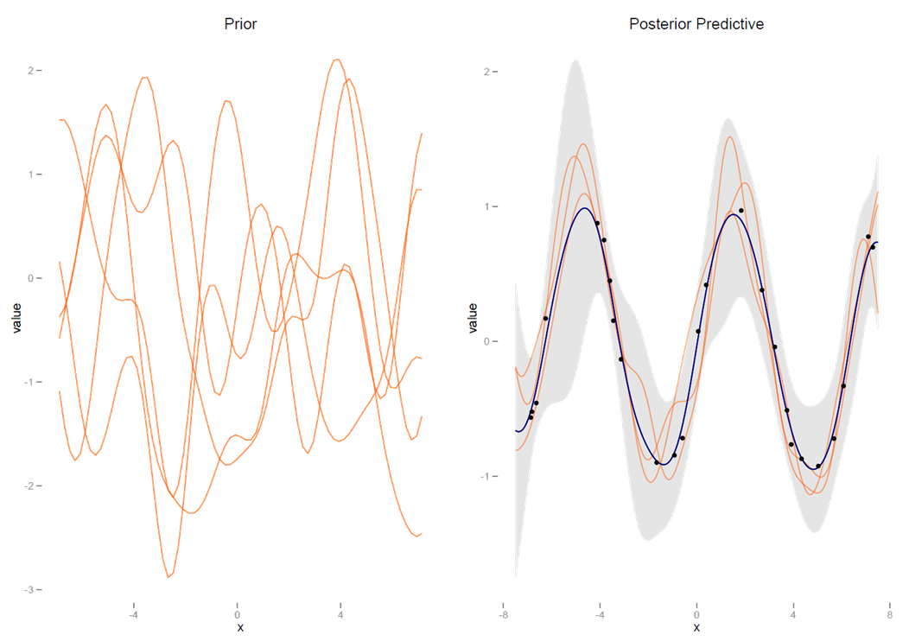

# Other Approaches

```{r setupApproaches, include=FALSE}
# knitr::opts_chunk$set(cache.rebuild=F, cache = T)
```

This section will discuss some ways to relate GAMs to other forms of nonlinear modeling approaches, some familiar and others perhaps less so.  In addition, I will note some extensions to GAMs to consider.

## Other Nonlinear Modeling Approaches


### Known Functional Form

It should be noted that one can place generalized additive models under a general heading of *nonlinear models* whose focus may be on transformations of the outcome (as with generalized linear models), the predictor variables (polynomial regression and GAMs), or both (GAMs), in addition to those whose effects are nonlinear in the parameters[^gennonlin] [^econecol]. A primary difference between GAMs and those models is that we don't specify the functional form of features beforehand with GAMs.

[^gennonlin]: A general form for linear and nonlinear models: $g(y) = f(X,\beta)+\epsilon$

In cases where the functional form may be known, one can use an approach such as *nonlinear least squares*, and there is inherent functionality with base R, such as the <span class="func">nls</span> function. As is the usual case, such functionality is readily extendable to a great many other analytic situations, e.g. the <span class="pack">gnm</span> for generalized nonlinear models or <span class="pack">nlme</span> for nonlinear mixed effects models.


### Response Transformation

As noted, it is common practice, perhaps too common, to manually transform the response and go about things with a typical linear model.  While there might be specific reasons for doing so, the primary reason many seem to do so is to make the distribution 'more normal' so that regular regression methods can be applied, which stems from a misunderstanding of the assumptions of standard regression.  As an example, a typical transformation is to take the log, particularly to tame 'outliers' or deal with heteroscedasticity.  

While it was a convenience 'back in the day' because we didn't have software or computing power to deal with a lot of data situations aptly, this is definitely not the case now.  In many cases it would be better to, for example, conduct a generalized linear model with a log link, or perhaps assume a different distribution for the response directly (e.g. log- or skew-normal), and many tools allow analysts to do this with ease[^outliers].

[^outliers]: A lot of 'outliers' tend to magically go away with an appropriate choice of distribution for the data generating process, or just more predictive features.

There are still cases where one might focus on response transformation, just not so one can overcome some particular nuisance in trying to fit a linear regression.  An example might be in some forms of *functional data analysis*, where we are concerned with some function of the response that has been measured on many occasions over time.  Another example would be in economics, where they like to talk of effects in terms of *elasticities*.


### The Black Box

</img> <br> <span style="text-align:center; display:block; width:300px">A Neural Net Model</span><br><br>


@venables_modern_2002[, Section 11.5] make an interesting delineation of nonlinear models into those that are less flexible but under full user control (fully parametric), and those that are *black box* techniques that are highly flexible and mostly if not  fully automatic: stuff goes in, stuff comes out, but we're not privy to the specifics[^twocultures].  


Two examples of the latter that they provide are *projection pursuit* and *neural net* models, though a great many would fall into such a heading.  Projection pursuit models are well suited to high dimensional data where dimension reduction is a concern.  One can think of an example where one uses a technique such as principal components analysis on the predictor set and then examines smooth functions of $M$ principal components. 

In the case of neural net models, which have found their stride over the last decade or so under the heading of *deep learning*, one can imagine a model where the input units (features) are  weighted and summed to create hidden layer units, which are then transformed and put through the same process to create outputs (see a simple example above).  Neural networks  are highly flexible in that there can be any number of inputs, hidden layers, and outputs, along with many, many other complexities besides.  And, while such models are very explicit in the black box approach, tools for interpretability have been much more accessible these days.

Such models are usually found among a number machine learning techniques, any number of which might be utilized in a number of disciplines. Other more algorithmic/black box approaches include *networks/graphical models*, and tree-based methods such as *random forests* and *gradient boosting*[^esl]. As Venables and Ripley note, generalized additive models might be thought of as falling somewhere in between the fully parametric and highly interpretable models of linear regression and more black box techniques, a *gray box* if you will.  Indeed, there are even algorithmic approaches which utilize GAMs as part of their approach, including neural additive models (e.g. @agarwal2021neural and @xu2022sparse).

## Bayesian Estimation

We can definitely take a [Bayesian approach](https://m-clark.github.io/bayesian-basics/) to our GAMs if desired, in fact, we already have!  When we called the <span class="func">summary</span> method, the p-values are based on the Bayesian posterior covariance matrix of parameters.  This matrix is also the basis for the standard errors whenever we use the <span class="func">predict</span> method. So our uncertainty estimates are generally Bayesian-ish when using our default approach for <span class="pack">mgcv</span>[^bayesfreq].

[^bayesfreq]: This happens to provide better frequentist coverage as well. See the documentation for the summary method.

For a fully Bayesian implementation, the <span class="pack">brms</span> package serves as an easy to use starting point in R, and has functionality for using the <span class="pack">mgcv</span> package's syntax style. The reason is that it just uses mgcv to 

```{r bayes-demo, eval=FALSE}
library(brms)

mod_bayes = brm(
  Overall ~ s(Income, bs = "cr"), 
  data = pisa, 
  thin = 4,
  cores = 4
)

conditional_effects(mod_bayes) 
```


```{r bayes-model-run, echo=FALSE, eval=FALSE}
library(brms)

mod_bayes = brm(
  Overall ~ s(Income, bs = "cr"), 
  data = pisa, 
  thin = 4,
  cores = 4,
  control = list(adapt_delta = .99),
  prior = c(
    # the gam coefs for the smooth are notably large, but not clear we need for
    # this parameterization (default is student(0, 50) anyway), and estimated
    # values did not change much setting these.
    prior(normal(0, 100), class = 'sds', coef = 's(Income, bs = "cr")'), 
    prior(normal(0, 10), class = 'b')
  )
)

saveRDS(mod_bayes, file = 'data/mod_bayes.rds')
```

Results are very similar as we would expect.

```{r bayes-demo-show, echo=FALSE}
library(brms)

mod_bayes = read_rds('data/mod_bayes.rds')

summary(mod_bayes)

conditional_effects(mod_bayes)
```


Here are 50 posterior draws from the model on the left, with .5, .8, and .95 fitted intervals on the right.

```{r bayes-demo-show2, echo=FALSE}
library(ggdist)
library(tidybayes)

p_draw = pisa %>%
  drop_na(Income) %>%
  add_epred_draws(mod_bayes, ndraws = 50) %>%
  ggplot(aes(x = Income, y = Overall)) +
  geom_line(aes(y = .epred, group = .draw), alpha = .1) +
  geom_point(size = .5, alpha = .1)

p_ribbon = pisa %>%
  drop_na(Income) %>%
  add_epred_draws(mod_bayes, ndraws = 50) %>%
  ggplot(aes(x = Income, y = Overall)) +
  stat_lineribbon(
    aes(y = .epred),
    size = 1,
    .width = c(.95, .80, .50),
    alpha = 1 / 4
  ) +
  geom_point(size = .5, alpha = .1) +
  scale_fill_scico_d(begin = .3,
                     end = .5,
                     palette = 'bukavu') 

p_draw + p_ribbon & lims(x = c(.4, .95), y = c(250, 550))
```

Here we compare the uncertainty in the fitted values between the Bayesian and standard <span class="pack">mgcv</span> approach[^brmsfit]. It looks like the <span class="pack">mgcv</span> credible intervals are generally good estimates, but that <span class="pack">brms</span> shows a bit more regularization. In any case, it's easy enough to try a Bayesian approach for your GAM if you want to!

[^brmsfit]: For brms, we're using the fitted method as this more resembles what mgcv is producing via predict.

```{r bayes-compare-uncertainty, echo=FALSE}
pred_data = tibble(Income = seq(
  min(pisa$Income, na.rm = TRUE),
  max(pisa$Income, na.rm = TRUE),
  length.out = 100
))

bayes_pred = fitted(mod_bayes, newdata = pred_data) %>%
  as_tibble() %>%
  mutate(model = 'bayes',
         Income = pred_data$Income)

mgcv_pred = predict(mod_gam1, newdata = pred_data, se.fit = TRUE) %>%
  as_tibble() %>%
  rename(Estimate = fit, Est.Error = se.fit) %>%
  mutate(
    Q2.5  = Estimate - 1.96 * Est.Error,
    Q97.5 = Estimate + 1.96 * Est.Error,
    model = 'mgcv',
    Income = pred_data$Income
  )

bind_rows(bayes_pred, mgcv_pred) %>% 
  ggplot(aes(x = Income, y = Estimate)) +
  geom_borderline(aes(color = model)) +
  geom_ribbon(aes(ymin = Q2.5, ymax = Q97.5, fill = model), alpha = .1) +
  geom_ribbon(aes(ymin = Q2.5, ymax = Q97.5, fill = model), alpha = .1)

# mod_bayes$fit
```


## Extensions

### Other GAMs

#### Categorical variables

Note that just as generalized additive models are an extension of the generalized linear model, there are generalizations of the basic GAM beyond the settings described.  In particular, *random effects* can be dealt with in this context as they can with linear and generalized linear models, and there is an interesting connection between smooths and random effects in general [^gamm].  This allowance for categorical variables, i.e. factors, works also to allow separate smooths for each level of the factor.  This amounts to an interaction of the sort we demonstrated with two continuous variables.  See the [appendix][A comparison to mixed models] for details.


#### Spatial Modeling

Additive models also provide a framework for dealing with spatially correlated data as well.  As an example, a *Markov Random Field* smooth can be implemented for discrete spatial structure, such as countries or states[^spatialneighbor].  For the continuous spatial domain, one can use the 2d smooth as was demonstrated previously, e.g. with latitude and longitude.  Again one can consult the [appendix][Space] for demonstration, and see also the Gaussian process paragraph.


[^spatialneighbor]: Incidentally, this same approach would potentially be applicable to network data as well, e.g. social networks.


#### Structured Additive Regression Models

The combination of random effects, spatial effects, etc. into the additive modeling framework is sometimes given a name of its own- *structured additive regression models*, or STARs[^linkedin].  It is the penalized regression approach that makes this possible, where we have a design matrix that might include basis functions or an indicator matrix for groups, and an appropriate penalty matrix.  With those two components, we can specify the models in almost identical fashion, and combine such effects within a single model.  This results in a very powerful regression modeling strategy.  Furthermore, the penalized regression described has a connection to Bayesian regression with a normal, zero-mean prior for the coefficients, providing a path toward even more flexible modeling.


#### GAMLSS

Generalized additive models for location, scale, and shape (*GAMLSS*) allow for distributions beyond the exponential family[^gamlss], and modeling different parameters besides the mean. <span class="pack">mgcv</span> also has several options in this regard.


#### Other

In addition, there are boosted, ensemble and other machine learning approaches that apply GAMs. It should be noted that [boosted models can be seen as  GAMs](http://projecteuclid.org/euclid.aos/1016218223). In short, there's plenty to continue to explore once one gets the hang of generalized additive models.


### Reproducing Kernel Hilbert Space

Generalized smoothing splines are built on the theory of *reproducing kernel Hilbert spaces*.  I won't pretend to be able to get into it here, but the idea is that some forms of additive models can be represented in the inner product form used in RKHS approaches[^rkhs].  This connection lends itself to a tie between GAMs and e.g. support vector machines and similar methods.  For the interested, I have an example of RKHS regression [here](https://m-clark.github.io/models-by-example/rkhs.html).


### Gaussian Processes


We can also approach modeling by using generalizations of the Gaussian distribution.  Where the Gaussian distribution is over vectors and defined by a mean vector and covariance matrix, a *Gaussian Process* is a *distribution over functions*. A function $f$ is distributed as a Gaussian Process defined by a mean function $m$ and covariance function $k$. They have a close tie to RKHS methods, and generalize commonly used models in spatial modeling.


$$f\sim \mathcal{GP}(m,k)$$

In the Bayesian context, we can define a prior distribution over functions and make draws from a posterior predictive distribution of $f$ once we have observed data.  The reader is encouraged to consult @rasmussen_gaussian_2006 for the necessary detail. The [text](http://www.gaussianprocess.org/gpml/) is free for download, and Rasmussen also provides a nice and brief [intro](http://link.springer.com/chapter/10.1007/978-3-540-28650-9_4).  I also have some R code for [demonstration](https://m-clark.github.io/models-by-example/gaussian-process.html) based on his Matlab code, as well as Bayesian examples in Stan in the same document, though Stan offers easier ways to do it these days. 

Suffice it to say in this context, it turns out that generalized additive models with a tensor product or cubic spline smooth are maximum a posteriori (MAP) estimates of Gaussian processes with specific covariance functions and a zero mean function. In that sense, one might segue nicely to Gaussian processes if familiar with additive models.  The <span class="pack">mgcv</span> package also allows one to use a spline form of Gaussian process. Furthermore, gaussian process regression is akin to a single layer neural network with an infinite number of hidden nodes. So there is a straightforward thread from GAMs to neural nets as well.


 <br> <span style="display:block; font-size: 8pt">*Gaussian Process*: The left graph shows functions from the prior distribution, the right shows the posterior mean function, 95% confidence interval shaded, as well as specific draws from the posterior predictive mean distribution.</span> <br>


[^econecol]: For example, various theoretically motivated models in economics and ecology. A common model example is the logistic growth curve.

[^twocultures]: For an excellent discussion of these different approaches to understanding data see @breiman_statistical_2001 and associated commentary.

[^esl]: See @hastie_elements_2009 for an overview of such approaches. A more recent and very applied version of that text is also [available](http://link.springer.com/book/10.1007/978-1-4614-7138-7?no-access=true). I have an R oriented intro [here](https://m-clark.github.io/introduction-to-machine-learning/).

[^gamm]: @wood_generalized_2017 has a whole chapter devoted to the subject, though @fahrmeir2013regression provides an even fuller treatment. I also have a document on [mixed models](http://m-clark.github.io/docs/mixedModels/mixedModelML.html) that goes into it some. In addition, Wood also provides a complementary package, <span class="pack">gamm4</span>, for adding random effects to GAMs via <span class="pack">lme4</span>.

[^linkedin]: Linkedin has used what they call **GAME**, or [Generalized Additive Mixed-Effect Model](https://github.com/linkedin/photon-ml#game---generalized-additive-mixed-effects), though these are called GAMMs (generalized additive mixed model) practically everywhere else.  The GAME implementation does appear to go beyond what one would do with the <span class="func">gamm</span> function in <span class="pack">mgcv</span>, or at least, takes a different and more scalable computational approach.


[^gamlss]: See @rigby_generalized_2005 and the <span class="pack">gamlss</span> package.

[^rkhs]: You might note that the function used in the spline example in the technical section is called *rk*.